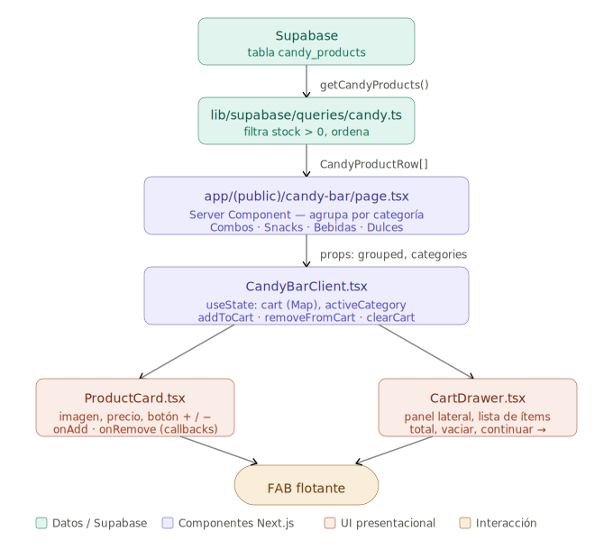
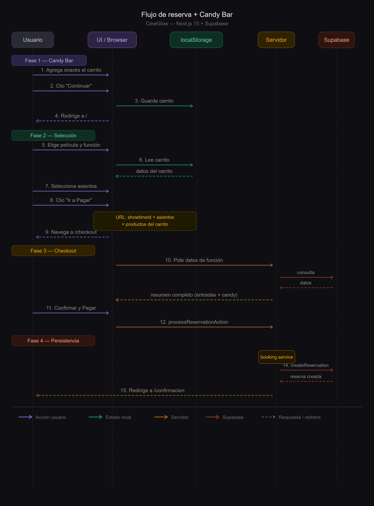

# CineGlow — Arquitectura App Router

Sistema de reserva de cine con separación clara entre UI, rutas, datos (Supabase) y patrones de diseño desacoplados.

## Principios

| Capa | Responsabilidad |
|------|-----------------|
| `app/` | Rutas, layouts, Server Components, Route Handlers |
| `components/` | UI presentacional y compuesta por dominio |
| `lib/supabase/` | Clientes, tipos DB y queries reutilizables |
| `patterns/` | Factory, Strategy, Decorator — **sin dependencias de React ni Supabase** |
| `services/` | Orquestación: conecta patterns + supabase + reglas de negocio |
| `types/` | Contratos de dominio compartidos |

## Flujo de datos

```
app/(booking)/reservar → services/booking → patterns/* → lib/supabase
                              ↑
                    components/booking (UI)
```

Los **patterns** reciben interfaces puras (`TicketContext`, `PricingContext`) definidas en `types/`. Los **services** instancian factories/strategies/decorators y persisten vía Supabase.

## Patrones en `patterns/`

### Factory — creación de entidades
- `TicketFactory`: genera `Ticket` según tipo (2D, 3D, IMAX, VIP).
- `CandyItemFactory`: genera ítems del candy bar (combo, bebida, snack).

### Strategy — algoritmos intercambiables
- **Pricing**: estándar, estudiante, promo, happy hour.
- **SeatSelection**: asientos normales vs. sala VIP vs. accesibilidad.

### Decorator — extras acumulables sobre un precio/base
- **Ticket**: base → +VIP → +3D → +combo candy.
- **Candy**: base → +tamaño grande → +extra mantequilla.


## Separación candy bar: UI vs patterns

| Capa | Tipos usados | Fuente de datos |
|------|-------------|-----------------|
| UI (`components/candy-bar/`) | `CandyProductRow`, `DbCandyCategory` | Supabase real |
| Patrones (`patterns/factory/`, `patterns/decorator/`) | `CandyItem`, `CandyCategory` | Catálogo interno |

Los componentes de UI trabajan directo con `CandyProductRow`. 
Los decorators (`LargeSizeDecorator`, `ExtraButterDecorator`, etc.) 
se aplican en el servicio de checkout al confirmar la reserva, 
no en la página del candy bar.

## Flujo del Candy Bar




## Flujo de Reserva + Candy Bar

El flujo completo combina selección de snacks, elección de función,
selección de asientos y confirmación de pago en un proceso de 3 pasos.

El carrito del Candy Bar persiste via `localStorage` entre páginas,
permitiendo al usuario armar su pedido antes o después de elegir la película.
Los datos viajan al checkout via URL params y se confirman en Supabase
mediante una Server Action (`processReservationAction`).

## Flujo de reserva + Candy Bar


